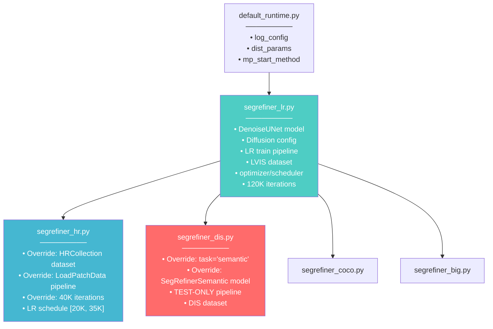
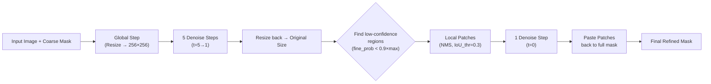

# Hướng Dẫn Chi Tiết: Train SegRefiner cho DIS-5K

## Tổng Quan

`segrefiner_dis.py` là config **chỉ dùng cho TEST/INFERENCE** trên DIS-5K dataset. Để train được model rồi test trên DIS, bạn cần hiểu toàn bộ pipeline gồm **2 giai đoạn train** và **1 giai đoạn test**.

> [!IMPORTANT]
> File `segrefiner_dis.py` KHÔNG có train pipeline — nó chỉ define test pipeline. 
> Để có model test trên DIS-5K, phải train qua 2 giai đoạn: **LR-SegRefiner** → **HR-SegRefiner**.

---

## 1. Cài Đặt Môi Trường

```bash
# Tạo conda environment
conda create -n segrefiner python=3.8
conda activate segrefiner

# Cài PyTorch (CUDA 11.3)
pip install torch==1.12.1+cu113 torchvision==0.13.1+cu113 torchaudio==0.12.1 \
    --extra-index-url https://download.pytorch.org/whl/cu113

# Cài mmcv
pip install openmim
mim install "mmcv-full==1.7.1"

# Cài SegRefiner (mmdet fork)
cd /Users/vuong/0.\ VUONG/SegRefiner
pip install -e .

# Cài LVIS API (cho boundary AP evaluation)
git clone -b lvis_challenge_2021 https://github.com/lvis-dataset/lvis-api.git
cd lvis-api
pip install -e .
```

> [!WARNING]
> - Yêu cầu **GPU NVIDIA** với CUDA 11.3+
> - `mmcv-full==1.7.1` phải compile C++/CUDA, có thể mất 10-20 phút
> - PyTorch 1.12.1 là phiên bản cứng, không nên thay đổi

---

## 2. Chuẩn Bị Dữ Liệu

### 2.1. Download datasets

| Dataset | Download Link | Dùng cho |
|---------|--------------|----------|
| **COCO 2017** | [cocodataset.org](https://cocodataset.org/#download) | Train LR |
| **LVIS v1** | [lvisdataset.org](https://www.lvisdataset.org/dataset) | Train LR |
| **DIS-5K** | [GitHub](https://github.com/xuebinqin/DIS) | Train HR + Test |
| **ThinObject-5K** | [GitHub](https://github.com/liewjunhao/thin-object-selection) | Train HR |
| **DIS-5K Coarse** (ISNet) | [Google Drive](https://drive.google.com/file/d/1PoI4R-thDYhAjqOaCwyXqvAaZFEJxWnT/view) | Test input |

### 2.2. Cấu trúc thư mục `data/`

```
SegRefiner/
└── data/
    ├── dis/
    │   ├── DIS-TR/          ← Training set
    │   │   ├── im/          ← Ảnh gốc (.jpg)
    │   │   ├── gt/          ← Ground truth masks (.png)
    │   │   ├── coarse/      ← [Sẽ được sinh ra ở Bước 4]
    │   │   └── coarse_expand/  ← [Sẽ được sinh ra ở Bước 4]
    │   ├── DIS-TE1/         ← Test set 1
    │   │   └── im/
    │   ├── DIS-TE2/         ← Test set 2
    │   │   └── im/
    │   ├── DIS-TE3/         ← Test set 3
    │   │   └── im/
    │   ├── DIS-TE4/         ← Test set 4
    │   │   └── im/
    │   ├── DIS-VD/          ← Validation set
    │   │   ├── im/
    │   │   └── gt/
    │   └── coarse/
    │       └── isnet/       ← Kết quả ISNet (coarse masks cho test)
    │           ├── DIS-TE1/
    │           ├── DIS-TE2/
    │           ├── DIS-TE3/
    │           ├── DIS-TE4/
    │           └── DIS-VD/
    ├── thin_object/
    │   ├── images/
    │   ├── masks/
    │   └── list/
    │       └── train.txt
    ├── coco/
    │   ├── train2017/
    │   ├── val2017/
    │   └── annotations/
    │       ├── instances_train2017.json
    │       └── instances_val2017.json
    └── lvis/
        └── annotations/
            ├── lvis_v1_train.json
            └── lvis_v1_val.json
```

---

## 3. Config Inheritance Chain (Quan Trọng!)



### 3.1 `segrefiner_lr.py` — Base Config (Giai đoạn 1)

```python
# Model: DenoiseUNet
denoise_model = dict(
    type='DenoiseUNet',
    in_channels=4,     # 3 (RGB) + 1 (coarse mask)
    out_channels=1,    # binary mask output
    model_channels=128,
    num_res_blocks=2,
    num_heads=4,
    attention_strides=(16, 32),
    channel_mult=(1, 1, 2, 2, 4, 4),  # 6 levels
)

# Diffusion: 6-step linear schedule
diffusion_cfg = dict(
    betas=dict(type='linear', start=0.8, stop=0, num_timesteps=6),
    diff_iter=False
)

# Training: AdamW, 120K iters, batch_size=1
optimizer = dict(type='AdamW', lr=4e-4)
max_iters = 120000
lr_config = dict(policy='step', step=[80000, 100000], gamma=0.5)
```

> [!NOTE]
> **Cơ chế tạo coarse mask khi train LR**: Dùng `modify_boundary()` — một hàm biến đổi GT mask bằng cách:
> 1. Xóa bớt đỉnh contour (regional sampling)
> 2. Random dilate/erode
> 3. Mục tiêu: IoU ≈ 0.8 so với GT
> 
> Điều này có nghĩa coarse mask được tạo **online** trong mỗi iteration, không cần file coarse sẵn.

### 3.2 `segrefiner_hr.py` — High-Resolution (Giai đoạn 2)

```python
# Dataset: HRCollectionDataset (DIS-TR + ThinObject)
# Pipeline: LoadPatchData (cắt patch + object crop)
# Training: 40K iters (fine-tune từ LR checkpoint)
# LR schedule: [20K, 35K]
```

### 3.3 `segrefiner_dis.py` — Test Config

```python
# task='semantic' → dùng SegRefinerSemantic class
# Test pipeline: LoadImageFromFile → LoadCoarseMasks → Normalize → Format
# Dataset: DISDataset với coarse masks từ ISNet
# Test-time inference: global step (5 bước) + local refinement (1 bước)
# test_cfg: model_size=256, fine_prob_thr=0.9, iou_thr=0.3, batch_max=32
```

---

## 4. Quy Trình Train Đầy Đủ

### Giai đoạn 1: Train LR-SegRefiner (trên LVIS)

```bash
cd /Users/vuong/0.\ VUONG/SegRefiner

# Single GPU
python tools/train.py configs/segrefiner/segrefiner_lr.py

# Multi GPU (ví dụ 4 GPUs)
bash tools/dist_train.sh configs/segrefiner/segrefiner_lr.py 4

# Với custom work_dir
python tools/train.py configs/segrefiner/segrefiner_lr.py \
    --work-dir work_dirs/segrefiner_lr_exp1

# Resume training
python tools/train.py configs/segrefiner/segrefiner_lr.py \
    --resume-from work_dirs/segrefiner_lr/latest.pth
```

**Chi tiết:**
- **Dataset**: LVIS v1 train (100K+ images, 1200+ categories)
- **Coarse mask**: Tạo online bằng `modify_boundary()`
- **Training pipeline**: `LoadImage → LoadAnnotations → LoadCoarseMasks → LoadObjectData → Resize(256×256) → RandomFlip → Normalize → Format`
- **Iterations**: 120K, checkpoint mỗi 5K iters
- **Output**: `work_dirs/segrefiner_lr/latest.pth`
- **Thời gian ước tính**: ~24-48h trên 1× V100

> [!TIP]
> Nếu KHÔNG muốn train từ đầu, download pretrained: 
> [LR-SegRefiner](https://drive.google.com/file/d/1FrhbdwNyTlQYNbF9IgFF2tY3iQXHFcau/view?usp=sharing)

---

### Giai đoạn 2: Sinh Coarse Masks Offline (cho HR training)

```bash
python scripts/gen_coarse_masks_hr.py
```

Script này:
1. Đọc tất cả GT masks từ `data/dis/DIS-TR/gt/` và `data/thin_object/masks/`
2. Áp dụng `modify_boundary()` để tạo coarse masks
3. Lưu vào `data/dis/DIS-TR/coarse/` và `data/thin_object/coarse/`
4. Tạo `data/collection_hr.json` — JSON index cho `HRCollectionDataset`
5. Sử dụng 20 processes (multiprocessing) cho tốc độ

> [!WARNING]
> Script sử dụng `mp.Pool(processes=20)`. Nếu máy ít CPU cores, giảm con số này trong file `scripts/gen_coarse_masks_hr.py`.

---

### Giai đoạn 3: Train HR-SegRefiner (trên DIS-TR + ThinObject)

```bash
# Single GPU
python tools/train.py configs/segrefiner/segrefiner_hr.py \
    --cfg-options load_from='work_dirs/segrefiner_lr/latest.pth'

# Multi GPU
bash tools/dist_train.sh configs/segrefiner/segrefiner_hr.py 4 \
    --cfg-options load_from='work_dirs/segrefiner_lr/latest.pth'
```

**Chi tiết:**
- **Dataset**: `HRCollectionDataset` = DIS-TR + ThinObject-5K
- **Pipeline**: `LoadImage → LoadAnnotations → LoadPatchData → Resize(256×256) → RandomFlip → Normalize → Format`
- **`LoadPatchData`**: Cắt 2 loại crop: object crop (bao quanh object) + random patch crop
- **Iterations**: 40K (fine-tune), checkpoint mỗi 5K iters
- **Output**: `work_dirs/segrefiner_hr/latest.pth`

> [!TIP]
> Download pretrained HR: [HR-SegRefiner](https://drive.google.com/file/d/143kerk4WOerGZMqR-cAETb7rOcoQ0CQ_/view?usp=sharing)

---

## 5. Test trên DIS-5K (Sử dụng `segrefiner_dis.py`)

### 5.1. Chuẩn bị coarse masks cho test

Download [DIS-5K coarse masks](https://drive.google.com/file/d/1PoI4R-thDYhAjqOaCwyXqvAaZFEJxWnT/view) (output ISNet) và đặt vào:

```
data/dis/coarse/isnet/
├── DIS-TE1/   ← Coarse masks (.png)
├── DIS-TE2/
├── DIS-TE3/
├── DIS-TE4/
└── DIS-VD/
```

### 5.2. Chạy inference

```bash
# Single GPU
python tools/test.py \
    configs/segrefiner/segrefiner_dis.py \
    work_dirs/segrefiner_hr/latest.pth \
    --out_dir results/dis_refined

# Multi GPU
bash tools/dist_test.sh \
    configs/segrefiner/segrefiner_dis.py \
    work_dirs/segrefiner_hr/latest.pth 4 \
    --out_dir results/dis_refined

# Thay đổi số diffusion steps (default=6)
python tools/test.py \
    configs/segrefiner/segrefiner_dis.py \
    work_dirs/segrefiner_hr/latest.pth \
    --out_dir results/dis_refined --step 10
```

**Output**: Refined masks lưu dưới dạng `.png` trong `results/dis_refined/`:
```
results/dis_refined/
├── DIS-TE1/
├── DIS-TE2/
├── DIS-TE3/
├── DIS-TE4/
└── DIS-VD/
```

### 5.3. Test-time inference flow (SegRefinerSemantic)



---

## 6. Evaluation

```bash
# Evaluate DIS-5K (IoU + boundary accuracy)
python scripts/eval_miou_dis.py \
    --gt data/dis/DIS-VD/gt \
    --coarse data/dis/coarse/isnet/DIS-VD \
    --refine results/dis_refined/DIS-VD
```

**Metrics output**:
- `New IoU`: IoU sau refine
- `Old IoU`: IoU của coarse (ISNet)
- `IoU Delta`: Improvement
- `New mBA`: mean Boundary Accuracy sau refine
- `Old mBA`: mBA của coarse
- `mBA Delta`: Improvement

---

## 7. Tóm Tắt Toàn Bộ Pipeline

```
┌─────────────────────────────────────────────────────────────────┐
│                     TRAINING PIPELINE                           │
├─────────────────────────────────────────────────────────────────┤
│                                                                 │
│  Step 1: Train LR-SegRefiner                                   │
│  ├── Dataset: LVIS v1 (COCO images)                            │
│  ├── Coarse: Online (modify_boundary)                          │
│  ├── Config: segrefiner_lr.py                                  │
│  ├── Iters: 120K                                               │
│  └── Output: segrefiner_lr/latest.pth                          │
│                                                                 │
│  Step 2: Generate Offline Coarse Masks                          │
│  ├── Script: gen_coarse_masks_hr.py                            │
│  ├── Input: DIS-TR/gt + thin_object/masks                      │
│  └── Output: coarse/ + coarse_expand/ + collection_hr.json     │
│                                                                 │
│  Step 3: Train HR-SegRefiner                                   │
│  ├── Dataset: DIS-TR + ThinObject (HRCollectionDataset)        │
│  ├── Coarse: Offline (từ Step 2)                               │
│  ├── Config: segrefiner_hr.py                                  │
│  ├── Init: load_from LR checkpoint                             │
│  ├── Iters: 40K                                                │
│  └── Output: segrefiner_hr/latest.pth                          │
│                                                                 │
├─────────────────────────────────────────────────────────────────┤
│                     TESTING PIPELINE                            │
├─────────────────────────────────────────────────────────────────┤
│                                                                 │
│  Step 4: Inference on DIS-5K                                   │
│  ├── Config: segrefiner_dis.py                                 │
│  ├── Checkpoint: segrefiner_hr/latest.pth                      │
│  ├── Coarse Input: ISNet output (data/dis/coarse/isnet/)       │
│  └── Output: refined .png masks                                │
│                                                                 │
│  Step 5: Evaluate                                               │
│  ├── Script: eval_miou_dis.py                                  │
│  └── Metrics: IoU, mBA (boundary accuracy)                     │
│                                                                 │
└─────────────────────────────────────────────────────────────────┘
```

---

## 8. Tips & Lưu Ý

### GPU Memory
- **LR training**: ~8-10 GB VRAM (batch_size=1, object_size=256)
- **HR training**: ~12-16 GB VRAM (object + patch crops)
- **Test**: ~6-8 GB VRAM (batch_max=32 cho local patches)

### Customization thường gặp

| Muốn thay đổi | Sửa ở đâu | Ghi chú |
|---|---|---|
| Learning rate | `segrefiner_lr.py:65` | Default 4e-4 |
| Số iterations | `segrefiner_lr.py:72` / `segrefiner_hr.py:37` | LR=120K, HR=40K |
| Batch size | `train_dataloader.samples_per_gpu` | Default 1 |
| Diffusion steps | `segrefiner_lr.py:29` hoặc `--step` flag | Default 6 |
| Model size (channels) | `segrefiner_lr.py:16` | Default 128 |
| Checkpoint interval | `segrefiner_lr.py:96` | Default 5000 iters |
| Fine prob threshold (test) | `segrefiner_dis.py:13` | Controls local refinement sensitivity |

### Nếu chỉ muốn test (dùng pretrained)

```bash
# 1. Download checkpoints
mkdir checkpoints
# Download LR và HR models từ Google Drive links ở trên

# 2. Prepare DIS coarse masks (ISNet output)
# Download và đặt vào data/dis/coarse/isnet/

# 3. Run test
python tools/test.py \
    configs/segrefiner/segrefiner_dis.py \
    checkpoints/segrefiner_hr_latest.pth \
    --out_dir results/dis_refined

# 4. Evaluate
python scripts/eval_miou_dis.py \
    --gt data/dis/DIS-VD/gt \
    --coarse data/dis/coarse/isnet/DIS-VD \
    --refine results/dis_refined/DIS-VD
```
