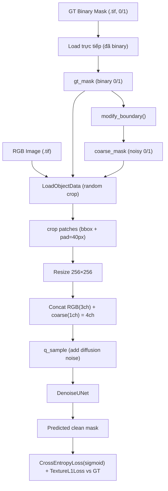
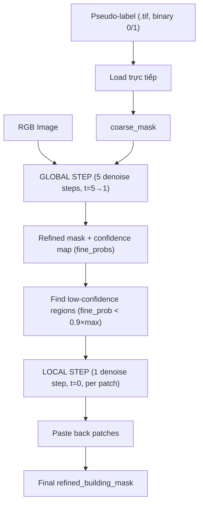

# Training Pipeline: SegRefiner cho OEM Building (Binary Class)

> **Tài liệu**: Hướng dẫn chi tiết adapt SegRefiner (NeurIPS 2023) cho bài toán binary Building segmentation refinement trên OpenEarthMap.

---

## 1. Tổng quan

### 1.1 Mục tiêu
Huấn luyện SegRefiner để **refine pseudo-label Building mask** (output của CISC-R) → gần đúng ground truth hơn.

### 1.2 Tại sao chọn Binary Building trước?
Từ [research_briefing.md](file:///home/ubuntu/vuong_denoiser/BUILDING/SegRefinerDenoiser_Building/docs/research_briefing.md):
- **Building** có retention rate cao nhất (81.8%), noise rate thấp nhất (18.19%)
- Noise chủ yếu là **Building → Developed** confusion (15.8%)  
- Ranh giới Building rõ ràng trong satellite imagery
- **Phù hợp nhất** để validate SegRefiner pipeline trước khi scale multi-class

### 1.3 Chiến lược: Follow paper gốc 100%
SegRefiner paper train binary mask refinement — **chính xác** bài toán của chúng ta:

| Aspect | Paper gốc (DIS) | Bài toán của ta (OEM Building) |
|--------|-----------------|-------------------------------|
| Input | RGB (3ch) + coarse mask (1ch) | RGB (3ch) + coarse building mask (1ch) |
| Output | Refined binary mask (1ch) | Refined building binary mask (1ch) |
| Loss | `CrossEntropyLoss(use_sigmoid=True, loss_weight=1.0)` + `TextureL1Loss(loss_weight=5.0)` | Giữ nguyên |
| Diffusion | 6-step linear schedule (start=0.8, stop=0) | Giữ nguyên |
| Coarse mask training | `modify_boundary()` từ GT | `modify_boundary()` từ GT (giữ nguyên) |
| Coarse mask inference | External model output | Pseudo-label CISC-R |

---

## 2. Data Layout

### 2.1 Cấu trúc thư mục (trên server training)

```
~/vuong_denoiser/BUILDING/SegRefinerDenoiser_Building/
├── data/
│   └── OEM_v2_Building/              ← symlink → thietkedenoiser/data/OEM_v2_Building
│       ├── images/                   ← RGB satellite images (.tif, 6 kích thước khác nhau)
│       │   ├── aachen_1.tif
│       │   ├── aachen_10.tif
│       │   └── ... (2189 files, FLAT — không chia subdirs)
│       ├── labels/                   ← GT binary building masks (.tif, 0/1)
│       │   ├── aachen_1.tif
│       │   └── ... (2189 files, FLAT)
│       ├── pseudolabels/             ← CISC-R pseudo labels (.tif, binary 0/1)
│       │   ├── aachen_1.tif
│       │   └── ... (2189 files, FLAT)
│       ├── train.txt                 ← 1721 filenames (split file)
│       ├── val.txt                   ← 218 filenames
│       └── test.txt                  ← 220 filenames
├── configs/segrefiner/
├── mmdet/datasets/
└── ...
```

> [!NOTE]
> Data **không chia** thành subdirectories `train/val/test`. Thay vào đó dùng **split files** (`.txt`) chứa danh sách tên file (mỗi dòng một filename, ví dụ `svaneti_60.tif`). Dataset class cần đọc split file để biết file nào thuộc split nào.

### 2.2 Data Format
- **Images**: RGB `.tif`, uint8, **6 kích thước khác nhau**:

| Kích thước (W×H) | Số lượng files | Tỷ lệ |
|-------------------|---------------|--------|
| 1024×1024 | 1535 | 70.1% |
| 1000×1000 | 426 | 19.5% |
| 650×650 | 156 | 7.1% |
| 900×900 | 30 | 1.4% |
| 438×406 | 23 | 1.1% |
| 439×406 | 19 | 0.9% |

- **Labels**: Single-channel `.tif`, uint8, mode=`L`, **đã là binary mask** (0 = background, 1 = building)
- **Pseudo-labels**: Cùng format binary với labels, output từ CISC-R

> [!IMPORTANT]
> Dataset OEM gốc có 8 classes (ID 0–7, class 7 = Building). Data `OEM_v2_Building` đã được **pre-convert sang binary** (0/1). **Không cần** thực hiện extraction `(pixel == 7)` nữa.

### 2.3 Data Statistics

| Split | Số lượng files |
|-------|---------------|
| Train | 1721 |
| Val | 218 |
| Test | 220 |
| **Tổng trong splits** | **2159** |
| **Tổng files thực tế** | **2189** |
| **Không thuộc split nào** | **30 files** |

> [!NOTE]
> 30 files tồn tại trong `images/`, `labels/`, `pseudolabels/` nhưng **không xuất hiện** trong bất kỳ split file nào. Không có file nào xuất hiện trong nhiều hơn 1 split (không overlap).

---

## 3. Architecture & Data Flow

### 3.1 Training Flow



### 3.2 Inference Flow (Test)



---

## 4. Changes Required

### 4.1 File Changes Summary

| File | Action | Description |
|------|--------|-------------|
| `mmdet/datasets/oem_building.py` | **NEW** | Dataset class cho OEM Building |
| `mmdet/datasets/__init__.py` | **MODIFY** | Register OEMBuildingDataset |
| `configs/segrefiner/segrefiner_oem_building.py` | **NEW** | Training config |
| `configs/segrefiner/segrefiner_oem_building_test.py` | **NEW** | Test config |
| `scripts/eval_oem_building.py` | **NEW** | Evaluation script |

> [!NOTE]
> **Không cần sửa bất kỳ model code nào** (DenoiseUNet, SegRefiner, SegRefinerSemantic). Tất cả đã support binary mask out-of-the-box.

### 4.2 Chi tiết: `oem_building.py`

```python
@DATASETS.register_module()
class OEMBuildingDataset(Dataset):
    CLASSES = ('background', 'building')
    # Labels đã là binary (0/1), KHÔNG cần convert từ class ID
    
    def __init__(self, data_root, img_dir='images', label_dir='labels',
                 pseudo_dir='pseudolabels', split_file=None,
                 pipeline=[], test_mode=False):
        # Đọc split file (.txt) để lấy danh sách filenames
        # Train mode: load images + GT binary labels
        # Test mode: load images + pseudo-labels (binary) as coarse masks
```

**Key behaviors:**
- **Train mode**: `__getitem__` returns dict with `img_info`, `ann_info` (containing GT building mask)
  - Pipeline `LoadAnnotations` loads GT → `LoadCoarseMasks` applies `modify_boundary()`
- **Test mode**: `__getitem__` returns dict with `img_info`, `coarse_info` (path to pseudo-label binary mask)
  - Pipeline `LoadCoarseMasks(test_mode=True)` loads pseudo-label directly

**Tham khảo**: `LVISRefine` ([lvis_refine.py](file:///home/ubuntu/vuong_denoiser/BUILDING/SegRefinerDenoiser_Building/mmdet/datasets/lvis_refine.py)) và `DISDataset` ([dis.py](file:///home/ubuntu/vuong_denoiser/BUILDING/SegRefinerDenoiser_Building/mmdet/datasets/dis.py)) là hai dataset class hiện có dùng cho SegRefiner pipeline.

### 4.3 Chi tiết: Training Config

**Model config** — giữ nguyên 100% từ `segrefiner_lr.py`:
```python
model = dict(
    type='SegRefiner',
    task='instance',        # 'instance' for training (affects test-time routing only)
    step=6,
    denoise_model=dict(
        type='DenoiseUNet',
        in_channels=4,       # 3 RGB + 1 mask
        out_channels=1,      # binary output
        model_channels=128,
        num_res_blocks=2,
        num_heads=4,
        num_heads_upsample=-1,
        attention_strides=(16, 32),
        learn_time_embd=True,
        channel_mult=(1, 1, 2, 2, 4, 4),
        dropout=0.0),
    diffusion_cfg=dict(
        betas=dict(type='linear', start=0.8, stop=0, num_timesteps=6),
        diff_iter=False),
    # Loss defaults (defined in SegRefiner.__init__, no need to specify in config):
    # loss_mask=dict(type='CrossEntropyLoss', use_sigmoid=True, loss_weight=1.0)
    # loss_texture=dict(type='TextureL1Loss', loss_weight=5.0)
    test_cfg=dict())
```

**Training hyperparameters:**

| Parameter | Value | Rationale |
|-----------|-------|-----------| 
| `max_iters` | 60,000 | Paper dùng 120K trên LVIS (~100K images). OEM chỉ có ~1721 train images → giảm proportional: ~35 epochs |
| `lr` | 4e-4 | Giống paper gốc (`segrefiner_lr.py:65`) |
| `optimizer` | AdamW (weight_decay=0, eps=1e-8, betas=(0.9, 0.999)) | Giống paper gốc |
| `lr_schedule` | step [40K, 55K], gamma=0.5 | Proportional từ paper [80K, 100K] / 120K × 60K |
| `object_size` | 256×256 | Giống paper gốc |
| `batch_size` | 1 per GPU | Giống paper gốc |
| `checkpoint_interval` | 5000 iters | Giống paper gốc |

**Pipeline** (giữ nguyên structure từ `segrefiner_lr.py`):
```python
train_pipeline = [
    dict(type='LoadImageFromFile'),                                    # Load RGB .tif
    dict(type='LoadAnnotations', with_bbox=False, with_label=False, with_mask=True),  # Load GT building mask
    dict(type='LoadCoarseMasks'),                                      # modify_boundary() online, test_mode=False default
    dict(type='LoadObjectData'),                                       # Random crop around object, pad_size=40 default
    dict(type='Resize', img_scale=(256, 256), keep_ratio=False),       # Resize to model size
    dict(type='RandomFlip', flip_ratio=0.5),                           # Augmentation
    dict(type='Normalize', mean=[123.675, 116.28, 103.53],             # ImageNet stats
                           std=[58.395, 57.12, 57.375], to_rgb=True),
    dict(type='DefaultFormatBundle'),
    dict(type='Collect', keys=['object_img', 'object_gt_masks', 'object_coarse_masks'])
]
```

> [!IMPORTANT]
> `LoadCoarseMasks` (default `test_mode=False`) sẽ gọi `modify_boundary()` trên GT mask (×255 → uint8) để tạo coarse mask online. Hàm `modify_boundary()` perturb boundary với target IoU ≈ 0.8 so với GT. Model học refine **bất kỳ noisy boundary mask nào**, không overfit vào noise pattern cụ thể của CISC-R.

### 4.4 Chi tiết: Test Config

Override sang `SegRefinerSemantic` cho inference:
```python
model = dict(
    type='SegRefinerSemantic',
    task='semantic',
    test_cfg=dict(model_size=256, fine_prob_thr=0.9, iou_thr=0.3, batch_max=32))

test_pipeline = [
    dict(type='LoadImageFromFile'),
    dict(type='LoadCoarseMasks', test_mode=True),    # Load pseudo-label trực tiếp
    dict(type='Normalize', mean=[123.675, 116.28, 103.53],
                           std=[58.395, 57.12, 57.375], to_rgb=True),
    dict(type='DefaultFormatBundle'),
    dict(type='Collect', keys=['img', 'coarse_masks'])
]
```

---

## 5. Training Commands

### 5.1 Prerequisites
```bash
python -c "import mmcv; import mmdet; print(f'mmcv: {mmcv.__version__}, mmdet: {mmdet.__version__}')"
nvidia-smi
```

### 5.2 Dry-run Validation
```bash
# Test config loads correctly
python -c "
from mmcv import Config
cfg = Config.fromfile('configs/segrefiner/segrefiner_oem_building.py')
print(cfg.pretty_text)
"

# Test dataset loads correctly
python -c "
from mmdet.datasets import build_dataset
from mmcv import Config
cfg = Config.fromfile('configs/segrefiner/segrefiner_oem_building.py')
ds = build_dataset(cfg.data.train)
print(f'Dataset size: {len(ds)}')
sample = ds[0]
print(f'Keys: {list(sample.keys())}')
"
```

### 5.3 Training
```bash
# Single GPU
python tools/train.py configs/segrefiner/segrefiner_oem_building.py \
    --work-dir work_dirs/segrefiner_oem_building

# Quick test (10 iterations)
python tools/train.py configs/segrefiner/segrefiner_oem_building.py \
    --work-dir work_dirs/segrefiner_oem_building_test \
    --cfg-options runner.max_iters=10

# Multi-GPU (2 GPUs)
bash tools/dist_train.sh configs/segrefiner/segrefiner_oem_building.py 2 \
    --work-dir work_dirs/segrefiner_oem_building
```

### 5.4 Inference
```bash
python tools/test.py \
    configs/segrefiner/segrefiner_oem_building_test.py \
    work_dirs/segrefiner_oem_building/latest.pth \
    --out_dir results/oem_building_refined
```

### 5.5 Evaluation
```bash
python scripts/eval_oem_building.py \
    --data_root data/OEM_v2_Building \
    --split val \
    --refined_dir results/oem_building_refined
```

> [!NOTE]
> Labels đã là binary (0/1), không cần `--building_class_id`. Script sẽ đọc `val.txt` để lấy danh sách files.

---

## 6. Expected Training Behavior

| Iter | Expected IoU | `loss_mask` | Status |
|------|-------------|-------------|--------|
| 1K | 0.50-0.60 | ~0.5-0.7 | Model begins learning |
| 10K | 0.70-0.80 | ~0.2-0.3 | Reasonable shapes |
| 30K | 0.80-0.90 | ~0.1-0.15 | Good results |
| 60K | 0.85-0.95 | ~0.05-0.1 | Best results |

**Training time**: ~5-8 hours on 1×V100/A100

---

## 7. Design Decisions & Rationale

### Q1: Tại sao dùng `modify_boundary()` thay vì pseudo-label thật khi training?

**Answer**: Follow paper gốc. `modify_boundary()` tạo **diverse boundary noise patterns** (random erode/dilate + contour sampling + perturbation, target IoU ≈ 0.8 vs GT) → model học **general boundary refinement**. Khi inference với pseudo-label CISC-R, model vẫn generalize tốt vì đã thấy đủ variety. Train với pseudo-label thật → overfit vào specific CISC-R noise pattern.

### Q2: Tại sao 1 stage thay vì 2 stages (LR → HR) như paper?

**Answer**: Paper dùng 2 stages: LR train trên LVIS (100K+ instances, 120K iters) → HR fine-tune trên DIS-TR+ThinObject (40K iters). OEM chỉ có ~1721 training images → single stage 60K iters đủ. Nếu cần improve boundary quality ở original resolution, có thể thêm HR stage sau.

### Q3: Tại sao `task='instance'` khi training?

**Answer**: Trong code `SegRefiner.forward()` ([segrefiner_base.py:51](file:///home/ubuntu/vuong_denoiser/BUILDING/SegRefinerDenoiser_Building/mmdet/models/detectors/segrefiner_base.py#L51-L73)), `task` chỉ affect **test-time routing**: `return_loss=True` (training) → luôn gọi `forward_train()` bất kể task. `return_loss=False` (inference) → check `task` để route sang `simple_test_instance()` hoặc `simple_test_semantic()`. Training config dùng `SegRefiner` base class với `task='instance'`, test config override sang `SegRefinerSemantic` với `task='semantic'`.

### Q4: Images kích thước đa dạng (6 sizes) nhưng crop 256×256 — có vấn đề gì?

**Answer**: `LoadObjectData` crop vùng xung quanh building object (bbox from mask + padding=40px), rồi `Resize` về 256×256. Cụ thể:
1. `_mask2bbox()` tìm bounding box của mask
2. `ramdom_crop_object()` random crop quanh bbox (size = bbox + pad_size)
3. `Resize(256×256)` normalize kích thước

Images có 6 kích thước khác nhau (438×406 → 1024×1024) nhưng pipeline xử lý tốt nhờ crop-around-object + resize. Paper gốc cũng xử lý COCO images (~640px) theo cách tương tự.

### Q5: Inference trên ảnh kích thước lớn — làm sao xử lý?

**Answer**: `SegRefinerSemantic` ([segrefiner_semantic.py](file:///home/ubuntu/vuong_denoiser/BUILDING/SegRefinerDenoiser_Building/mmdet/models/detectors/segrefiner_semantic.py)) dùng 2-phase inference:
1. **Global step** (5 steps, t=5→1): Resize toàn bộ ảnh về `model_size=256`, chạy diffusion → refined mask + confidence map (`fine_probs`)
2. **Local step** (1 step, t=0): Tìm vùng `fine_prob < 0.9 × max_fine_prob`, NMS với `iou_thr=0.3`, crop patch 256×256 tại original resolution, refine → paste lại (weighted average cho overlapping patches)

Approach này xử lý ảnh **bất kỳ kích thước nào** mà không bị giới hạn GPU memory. Batch local patches bằng `batch_max=32`.
